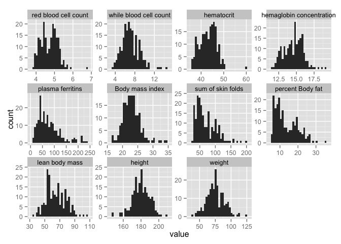
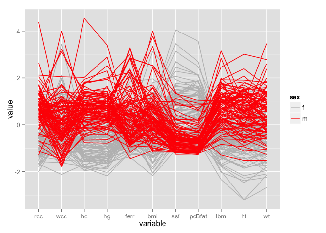
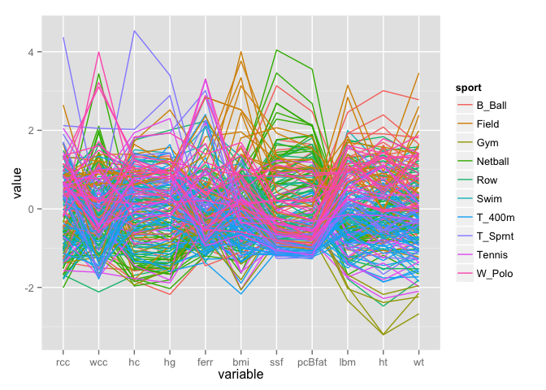

    library(DAAG)

    ## Loading required package: lattice

    library(ggplot2)
    library(tidyr)
    library(GGally)
    data(ais)

    ais_long <- gather(ais, key = measure, value = value, rcc:wt)

    levels(ais_long$measure) <- c("red blood cell count", "while blood cell count",
                                  "hematocrit", "hemaglobin concentration",
                                  "plasma ferritins", "Body mass index", 
                                  "sum of skin folds", "percent Body fat",
                                  "lean body mass", "height", 
                                  "weight")

    ggplot(data = ais_long, aes(value)) + geom_histogram() +
        facet_wrap( ~ measure, scales = "free")

    ## stat_bin: binwidth defaulted to range/30. Use 'binwidth = x' to adjust this.
    ## stat_bin: binwidth defaulted to range/30. Use 'binwidth = x' to adjust this.
    ## stat_bin: binwidth defaulted to range/30. Use 'binwidth = x' to adjust this.
    ## stat_bin: binwidth defaulted to range/30. Use 'binwidth = x' to adjust this.
    ## stat_bin: binwidth defaulted to range/30. Use 'binwidth = x' to adjust this.
    ## stat_bin: binwidth defaulted to range/30. Use 'binwidth = x' to adjust this.
    ## stat_bin: binwidth defaulted to range/30. Use 'binwidth = x' to adjust this.
    ## stat_bin: binwidth defaulted to range/30. Use 'binwidth = x' to adjust this.
    ## stat_bin: binwidth defaulted to range/30. Use 'binwidth = x' to adjust this.
    ## stat_bin: binwidth defaulted to range/30. Use 'binwidth = x' to adjust this.
    ## stat_bin: binwidth defaulted to range/30. Use 'binwidth = x' to adjust this.

    ggparcoord(ais, columns = 1:11, groupColumn = "sex") +
               scale_colour_manual(values = c("grey", "red"))

    ggparcoord(ais, columns = 1:11, groupColumn = "sport")

